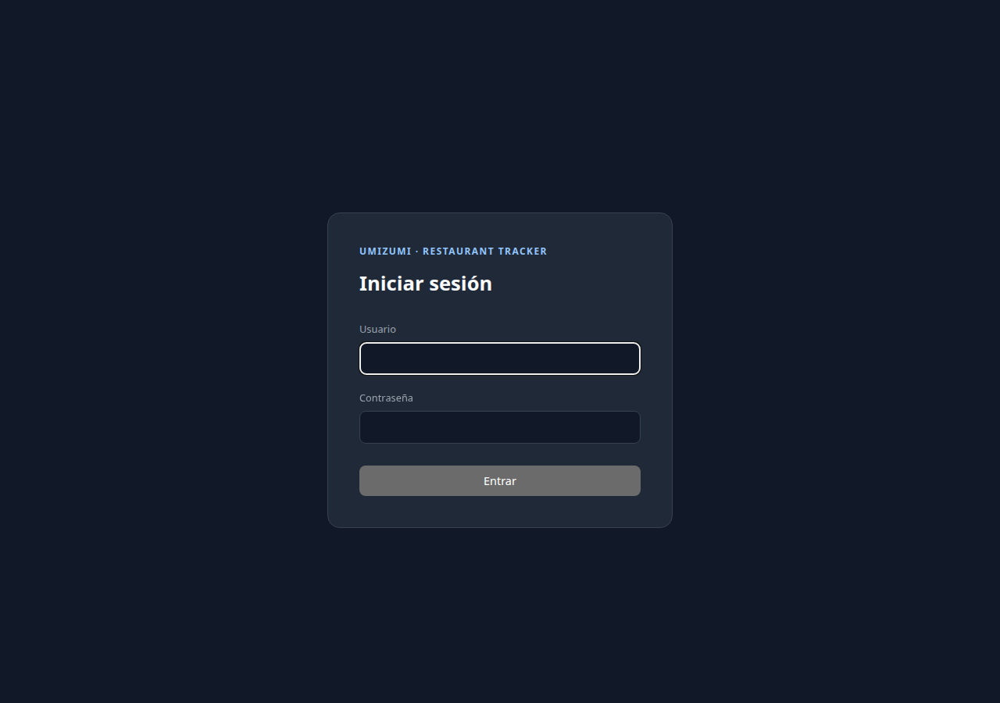
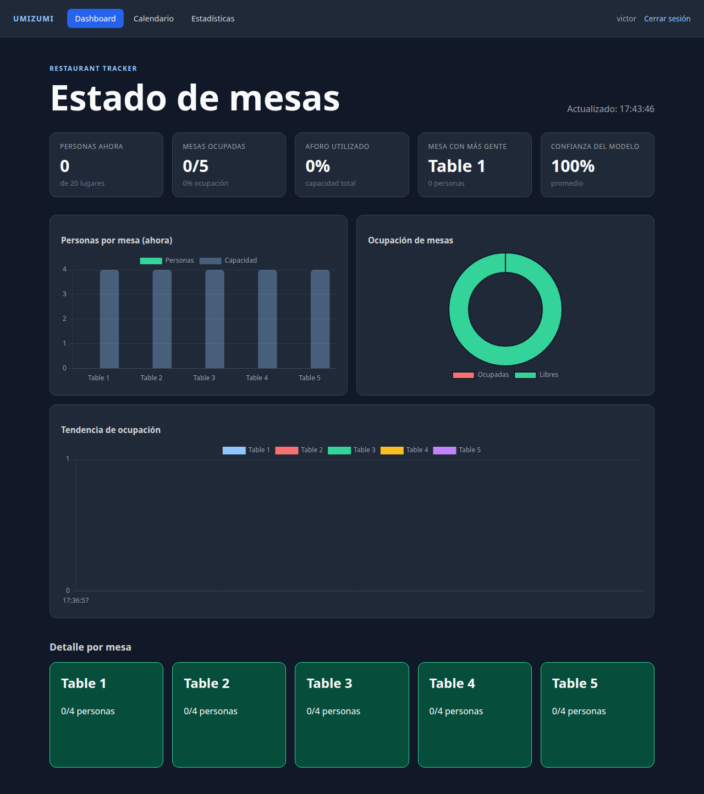
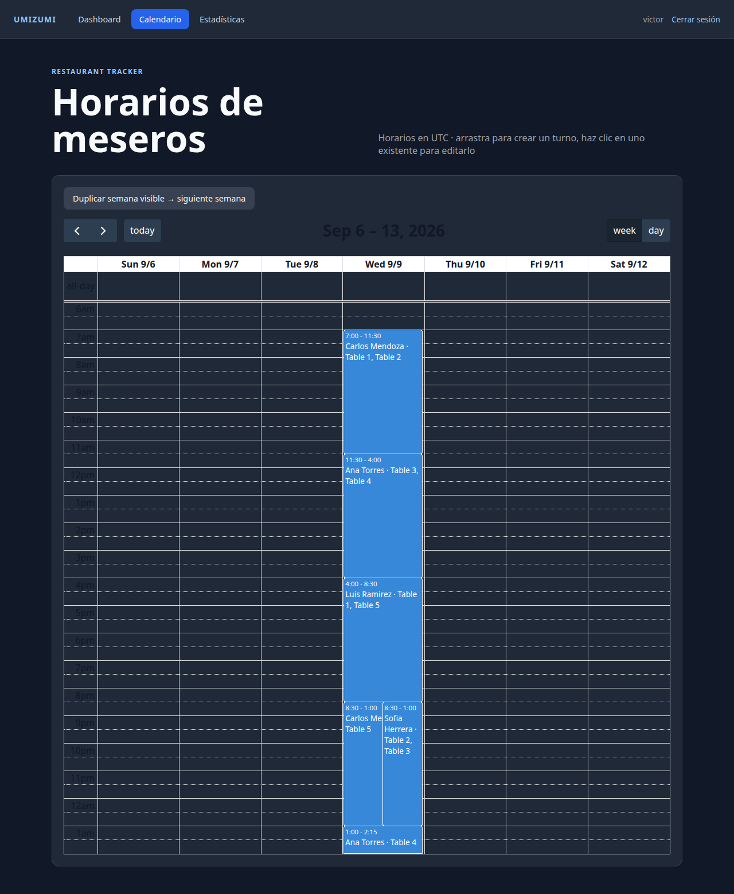
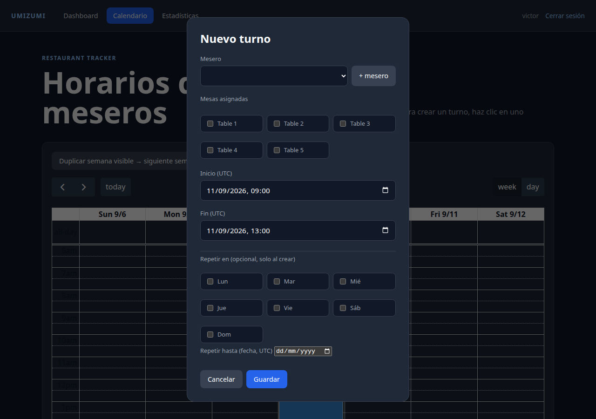
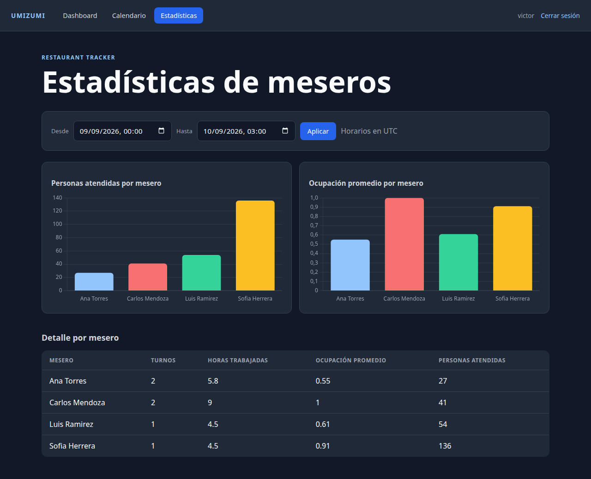

# Restaurant Tracking System

Pipeline Umizumi para monitorear la ocupación de mesas de un restaurante a
partir de video (una cámara/webcam en vivo) o imágenes sueltas, con un
dashboard operativo: estado en tiempo real, calendario de turnos de meseros y
reporte de estadísticas por mesero.

## Stack

- Python 3.12
- Flask + HTML/CSS/JavaScript nativo (sin framework de frontend), Chart.js y
  FullCalendar cargados por CDN
- PostgreSQL
- OpenCV para ingestión y extracción de frames, `yt-dlp`/`ffmpeg` para
  capturar un stream de YouTube como fuente en vivo
- Ultralytics YOLOv8 (detector `yolov8s`, clase "person") para la inferencia
- Docker Compose

## Arranque

Requiere Docker y Docker Compose:

```bash
cp .env.example .env
# editar .env: LIVE_STREAM_URL con la URL del video/live de YouTube a usar

docker compose up -d db web live
```

Dashboard: <http://localhost:8000> (pide login — ver [Login](#login) abajo)

Health check: <http://localhost:8000/health> (sin login)

Pruebas dentro de un contenedor temporal de aplicación:

```bash
docker compose run --rm worker python -m unittest discover -v
```

```text
----------------------------------------------------------------------
Ran 70 tests in 0.155s

OK
```

## Entrada de datos

Dos fuentes alimentan la misma tabla `frames` / `table_observations`:

1. **Archivos sueltos**: colocar imágenes `.jpg`, `.jpeg`, `.png` o vídeos
   `.mp4` en `data/inbox/` y correr `docker compose run --rm worker python -m
   app.worker`. El worker es un script ETL batch: procesa una vez el
   contenido actual de la carpeta, calcula SHA-256, transforma cada medio y
   solo después carga sus metadatos y frames en PostgreSQL. Las imágenes
   producen un frame; los vídeos producen frames cada
   `FRAME_INTERVAL_SECONDS`.
2. **Cámara en vivo**: el servicio `live` (`app/live_worker.py`) resuelve un
   stream de YouTube con `yt-dlp`, captura snapshots con `ffmpeg` cada
   `LIVE_CAPTURE_INTERVAL_SECONDS`, y repite el ciclo cada
   `LIVE_POLL_INTERVAL_SECONDS` (`LIVE_MODE=loop`, pensado para correr
   indefinidamente). Cada captura corre por el mismo pipeline de
   ingesta+detección+carga que los archivos sueltos.

En ambos casos, la detección corre con YOLOv8s sobre la clase "person",
`app/vision.py` asocia cada detección a un polígono de mesa fijo
(`db/seed.sql`, calibrado contra la cámara real), y el resultado
(`people_count`, `occupied`, `confidence`) se guarda por mesa y por frame en
`table_observations`.

Ejemplo real de un ciclo del servicio `live` (nota: 0 detecciones aquí porque
la webcam usada como fuente estaba fuera de su horario de transmisión en el
momento de esta captura — comportamiento correcto documentado, no un bug):

```text
$ docker compose run --rm -e LIVE_MODE=once -e LIVE_FRAME_COUNT=1 live
2026-09-18 23:36:48,991 INFO starting live capture: url=https://www.youtube.com/live/2wqpy036z24 mode=once frames=1 capture_interval=30s poll_interval=30s
2026-09-18 23:36:54,280 INFO captured live frame 1/1: /app/data/inbox/live_20260918T233651742101.jpg
2026-09-18 23:36:54,369 INFO loaded image input with 1 frame(s): live_20260918T233651742101.jpg
2026-09-18 23:36:57,341 INFO frame 699 (/app/data/processed/b0f492e.../0.jpg): 0 person detection(s) -> {1: 0, 2: 0, 3: 0, 4: 0, 5: 0}
2026-09-18 23:36:57,341 INFO live capture finished
```

Con la cámara activa durante horario real, un ciclo se ve así (capturado en
una sesión anterior):

```text
live-1  | 2026-09-09 21:33:44,433 INFO captured live frame 1/1: /app/data/inbox/live_20260909T213339514833.jpg
live-1  | 2026-09-09 21:33:44,822 INFO loaded image input with 1 frame(s): live_20260909T213339514833.jpg
live-1  | 2026-09-09 21:33:49,554 INFO frame 299 (/app/data/processed/9d07994f.../0.jpg): 14 person detection(s) -> {1: 4, 2: 2, 3: 0, 4: 1, 5: 4}
```

Para seguir el stream de logs de la cámara en vivo:

```bash
docker compose logs -f live
```

## Dashboard operativo

Todo el sitio (excepto `/health`) queda detrás de un login de sesión.

### Login

```text
usuario: victor
password: 123
```



La sesión usa la cookie firmada de Flask (`SECRET_KEY`); las contraseñas se
guardan hasheadas con `werkzeug.security` (scrypt), nunca en texto plano.

### Estado de mesas (`/`)

KPIs agregados (personas ahora, mesas ocupadas, % de aforo, mesa con más
gente, confianza promedio del modelo), gráfico de barras de personas por
mesa, dona de ocupación, tendencia de ocupación por mesa en las últimas
horas, y el detalle por mesa. Se refresca cada 30 segundos por polling (sin
WebSockets/SSE, por diseño).



### Calendario de turnos (`/schedule`)

Un mesero se asigna manualmente a una o más mesas durante una ventana de
tiempo (`waiter_shifts` + `waiter_shift_tables`). Esto es una capa de
negocio separada de la visión — no hay detección de meseros en el video, la
atribución mesero↔mesa es siempre manual. Horarios en UTC.



- **Crear turno**: arrastrar sobre el calendario abre el modal con el
  horario precargado.
- **Editar/eliminar**: clic en un turno existente.
- **Mover/extender**: arrastrar o redimensionar un turno ya creado.
- **Validación de conflictos**: un mesero no puede tener dos turnos
  solapados, ni una mesa puede tener dos meseros asignados al mismo tiempo —
  se rechaza con un mensaje claro en el modal.



**Patrones para agilizar la asignación** (los turnos siguen siendo filas
individuales con fecha específica por dentro — esto es solo una forma más
rápida de crearlos):

- **Repetir en días de la semana**: al crear un turno, marcar los días
  (Lun–Dom) y una fecha límite genera automáticamente un turno idéntico
  (mismo mesero, mismas mesas, mismo horario) en cada fecha que coincida.
  Cada ocurrencia se valida por separado — si alguna choca con un turno ya
  existente, esa fecha se omite y las demás se crean igual.
- **Duplicar semana**: el botón "Duplicar semana visible → siguiente semana"
  toma todos los turnos visibles en la semana actual del calendario y los
  recrea 7 días después, con la misma validación de conflictos por turno.

Verificado en vivo: repetir Lun/Mié/Vie generó 4 turnos adicionales sin
conflicto; duplicar una semana con turnos que ya tenían copias más adelante
correctamente creó 5 y omitió 2 por conflicto, mostrando el resumen en
pantalla.

### Estadísticas de meseros (`/waiters/stats`)

Selector de rango de fechas (UTC) + gráficos y tabla por mesero: turnos
trabajados, horas trabajadas, ocupación promedio y personas atendidas.



**Cómo se calculan las métricas** (importante, porque `table_observations`
son snapshots cada ~30-40s, no eventos de "servicio"):

- **Ocupación promedio**: promedio de `people_count` en las mesas asignadas
  al turno, durante la ventana del turno.
- **Personas atendidas**: NO es la suma cruda de `people_count` de cada
  frame (eso multiplicaría por ~90 el mismo grupo sentado una hora). Se
  detectan episodios de ocupación — rachas contiguas donde la mesa pasa de
  libre a ocupada y vuelve a libre — y se suma el pico de personas de cada
  episodio. Implementado en `_episode_people_served()`
  (`app/db.py`), con tests unitarios que cubren episodios cerrados,
  episodios aún abiertos al final de la ventana, y ventanas sin ocupación.

Ejemplo real vía API (mismo rango que la captura de arriba):

```text
$ curl -s -b cookies.txt "http://localhost:8000/api/waiters/stats?start=2026-09-09T00:00:00Z&end=2026-09-10T03:00:00Z" | python3 -m json.tool
[
    {
        "avg_occupancy": 0.55,
        "hours_worked": 5.8,
        "people_served": 27,
        "shifts": 2,
        "waiter_id": 2,
        "waiter_name": "Ana Torres"
    },
    {
        "avg_occupancy": 1.0,
        "hours_worked": 9.0,
        "people_served": 41,
        "shifts": 2,
        "waiter_id": 1,
        "waiter_name": "Carlos Mendoza"
    }
]
```

## Base de datos

```text
$ docker compose exec db psql -U restaurant -d restaurant_tracker -c "\dt"
                 List of relations
 Schema |        Name         | Type  |   Owner
--------+---------------------+-------+------------
 public | frames              | table | restaurant
 public | media_inputs        | table | restaurant
 public | table_observations  | table | restaurant
 public | tables              | table | restaurant
 public | users               | table | restaurant
 public | waiter_shift_tables | table | restaurant
 public | waiter_shifts       | table | restaurant
 public | waiters             | table | restaurant
(8 rows)
```

`users`, `waiters`, `waiter_shifts` y `waiter_shift_tables` son propiedad
exclusiva del dashboard (Umizumi 4) — no interfieren con el contrato de
lectura/escritura de `table_observations`/`frames`/`media_inputs`, que sigue
perteneciendo a ingestión (Umizumi 2) e inferencia (Umizumi 3). El dashboard
solo lee esas tres tablas, nunca escribe en ellas.

Ejemplo de turnos ya asignados (datos de muestra, `db/seed.sql`):

```text
$ docker compose exec db psql -U restaurant -d restaurant_tracker -c "
SELECT w.name AS mesero, s.starts_at, s.ends_at, string_agg(t.name, ', ' ORDER BY t.name) AS mesas
FROM waiter_shifts s
JOIN waiters w ON w.id = s.waiter_id
JOIN waiter_shift_tables wst ON wst.shift_id = s.id
JOIN tables t ON t.id = wst.table_id
WHERE s.starts_at >= '2026-09-09' AND s.starts_at < '2026-09-10'
GROUP BY w.name, s.id, s.starts_at, s.ends_at
ORDER BY s.starts_at;"

     mesero     |       starts_at        |        ends_at         |      mesas
-----------------+------------------------+------------------------+------------------
 Carlos Mendoza | 2026-09-09 07:00:00+00 | 2026-09-09 11:30:00+00 | Table 1, Table 2
 Ana Torres     | 2026-09-09 11:30:00+00 | 2026-09-09 16:00:00+00 | Table 3, Table 4
 Luis Ramirez   | 2026-09-09 16:00:00+00 | 2026-09-09 20:30:00+00 | Table 1, Table 5
 Carlos Mendoza | 2026-09-09 20:30:00+00 | 2026-09-10 01:00:00+00 | Table 5
 Sofia Herrera  | 2026-09-09 20:30:00+00 | 2026-09-10 01:00:00+00 | Table 2, Table 3
(5 rows)
```

## API

| Ruta | Método | Descripción |
| --- | --- | --- |
| `/health` | GET | Estado de conexión a la DB. Sin login. |
| `/login`, `/logout` | GET/POST, GET | Sesión de administrador. |
| `/api/tables/latest` | GET | Snapshot actual por mesa (`latest_table_state`). |
| `/api/tables/history` | GET | Histórico de observaciones (`?hours=`, 1–24). |
| `/api/waiters` | GET, POST | Listar / crear meseros. |
| `/api/shift-tables` | GET | Mesas disponibles para asignar. |
| `/api/shifts` | GET, POST | Turnos en un rango (`?start=&end=`) / crear uno. |
| `/api/shifts/<id>` | PUT, DELETE | Editar / borrar un turno. |
| `/api/shifts/bulk` | POST | Crear varios turnos a la vez (usado por los patrones de repetición); responde `207` con `created`/`conflicts` por índice, sin abortar el resto ante un conflicto puntual. |
| `/api/waiters/stats` | GET | Estadísticas agregadas por mesero (`?start=&end=`). |

Todas las rutas `/api/*` (salvo `/health`) responden `401` en JSON si no hay
sesión, en vez de redirigir — pensado para ser consumido por `fetch()` desde
el frontend.

Referencia de qué hace cada función/clase del proyecto (backend y frontend):
[`docs/CODE_REFERENCE.md`](docs/CODE_REFERENCE.md).

## Handoffs Umizumi

1. **Umizumi 1**: contenedores, schema y datos fijos.
2. **Umizumi 2**: ingestión y normalización a frames.
3. **Umizumi 3**: detector YOLOv8 real, segunda fuente de entrada (cámara en
   vivo por YouTube), carga a PostgreSQL. Detalles y limitaciones conocidas
   en `handoff-to-umizumi-4.md`.
4. **Umizumi 4**: dashboard operativo — KPIs y gráficos en tiempo real,
   login, calendario de turnos con patrones de repetición, estadísticas por
   mesero.

Los detalles de arquitectura originales están en
`docs/superpowers/specs/2026-09-07-restaurant-tracker-design.md` (nota: ese
documento es el diseño inicial del MVP: algunas secciones, como "detección
de video no incluida" o "sin identificación de meseros", quedaron
superadas por decisiones posteriores del dueño del proyecto, documentadas en
los handoffs).

## Restricciones del proyecto

- Sin Streamlit, Kafka, Airflow, Redis, Celery, ni un data lake.
- Dashboard sobre polling (30s); sin WebSockets/SSE.
- El dashboard (Umizumi 4) no escribe en `table_observations`, `frames` ni
  `media_inputs` — esas tablas siguen siendo propiedad de ingestión e
  inferencia.
- No hay identificación de meseros por video: la asignación mesero↔mesa es
  siempre manual, vía el calendario.
